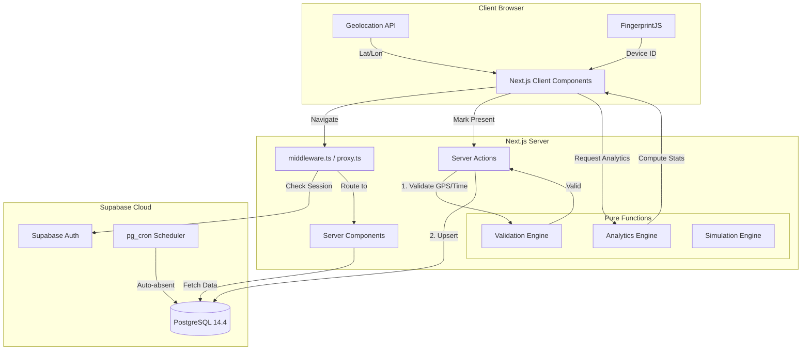

# AADSS Repository Intelligence Analysis

This document provides a comprehensive analysis of the Acadence (AADSS) repository, mapping its architecture, codebase structure, technology stack, and engineering quality. 

## 1. High-Level Architecture Overview

**Application Purpose**
AADSS (Academic Attendance Decision Support System) is a real-time intelligence platform designed to track student attendance. Unlike traditional systems that only display historical data, AADSS offers actionable insights, predicting future attendance trajectories and providing recovery paths to ensure students maintain exam eligibility.

**Business Domain**
EdTech / Academic Management & Operations.

**System Boundaries**
- **Frontend/Client:** Next.js application handling UI, geolocation (GPS via browser), and device fingerprinting.
- **Backend/Server:** Next.js Server Actions functioning as the API layer, executing business logic and validation.
- **Data/Auth Layer:** Supabase providing PostgreSQL database, user authentication (Supabase Auth), and scheduled jobs (pg_cron).

**Major Modules**
1. **Auth & Identity:** Handles login, registration, role management (student vs. admin), and device fingerprinting.
2. **Attendance Service:** Core tracking, time-window constraints, and geofence verification.
3. **Analytics Engine:** Computes risk scores, weekly trends, and required recovery classes.
4. **Simulation Engine:** "What-if" scenario planners (Skip Planner, Recovery Planner, Streak Simulator).
5. **Admin Operations:** Timetable scheduling, bulk semester promotions, session cancellation cascading, and defaulter reporting.

**Data Flow**
1. **Read:** Next.js Server Components fetch data from Supabase directly -> passed to Client Components for rendering.
2. **Write (Mutation):** Client Component invokes a Server Action -> Server Action runs pure validation functions (`lib/engines`) -> Server Action executes Supabase query -> `revalidatePath` updates UI.

**Request Lifecycle**
1. Incoming request -> `proxy.ts` (Middleware) evaluates route against user session and role.
2. Next.js App Router routes to specific `page.tsx`.
3. Server Component runs, fetching data using `lib/supabase/server.ts`.
4. Page renders interactively.

**Deployment Architecture**
- Frontend & Backend computing: Vercel (Serverless).
- Database & Auth: Supabase Cloud (PostgreSQL managed service).

---

## 2. Repository Structure Breakdown

```text
acadence/
├── app/                  # Next.js App Router (Pages & API routes)
│   ├── admin/            # Admin dashboard and management tools
│   ├── calendar-dashboard/ # Student calendar view
│   ├── daily-attendance/ # Core attendance marking UI
│   ├── login/ & register/# Authentication flows
│   └── simulate/         # Scenario planning tools
├── components/           # UI Components
│   ├── admin/            # Admin-specific layouts and modals
│   ├── common/           # Shared components (Headers, Navs)
│   └── ui/               # Shadcn UI primitives (buttons, dialogs, etc.)
├── lib/                  # Business Logic & Integrations
│   ├── admin/            # Admin server actions (promotions, defaulters)
│   ├── attendance/       # Attendance server actions
│   ├── engines/          # Pure functions for business rules
│   │   ├── analytics/    # Stats calculation
│   │   ├── simulation/   # Future planning logic
│   │   └── validation/   # Geofence & time checks
│   └── supabase/         # Supabase client initializers
├── db/                   # Database schemas and seed data
├── docs/                 # Project documentation
├── server/               # Auth actions and server-side utilities
├── supabase/             # Supabase CLI configurations and migrations
└── types/                # TypeScript definitions (incl. Supabase gen types)
```

**Identified Issues in Structure:**
- **Dead Code / Misplaced Files:** `proxy.ts` is in the root and acts as middleware, but Next.js expects `middleware.ts`. This means the middleware is currently *not executing* as a global middleware unless specifically imported in a custom server (which App Router doesn't use).
- **Duplicated Logic:** Authentication checks are repeated across almost all files in `lib/admin/*.ts`. A higher-order function or shared middleware strategy could DRY this up.
- **Generated Code:** `types/supabase.ts` is generated via Supabase CLI. Components in `components/ui/` are generated via shadcn CLI.
- **Entry Points:** 
  - UI Entry: `app/layout.tsx` and `app/page.tsx`.
  - Logic Entry: Server Actions in `lib/admin/actions.ts` and `lib/attendance/markAttendance.ts`.

---

## 3. Tech Stack Analysis

- **Framework:** Next.js 16.1.7 (App Router heavily utilized for RSCs and Server Actions).
- **Library:** React 19.2.3.
- **Styling:** Tailwind CSS v4, `clsx`, `tailwind-merge`.
- **UI Components:** `shadcn/ui` based on Radix UI.
- **Rich Text:** TipTap (for notes/configurations).
- **Database & Auth:** Supabase (PostgreSQL 14.4), `@supabase/ssr`, `@supabase/supabase-js`.
- **Package Manager:** npm.
- **Build System:** Next.js standard build (`next build`).
- **Infra Tooling:** Supabase CLI for database migrations and type generation.
- **Device Fingerprinting:** FingerprintJS (`@fingerprintjs/fingerprintjs`).

---

## 4. Dependency Intelligence

- **Critical Dependencies:** Next.js, React, Supabase SDKs. The app is deeply tied to the Supabase ecosystem for auth and data.
- **Outdated/Risky Dependencies:** React 19 and Next 16 are very new. Some third-party libraries (like `tw-animate-css` or certain Radix primitives) might face compatibility warnings. `FingerprintJS` has strict privacy implications and could be blocked by ad-blockers or Safari's privacy measures, breaking the "Device Lock" feature.
- **Tightly Coupled Modules:** The `lib/engines/` validation logic is wonderfully decoupled (pure functions), but the `lib/admin/actions.ts` is tightly coupled with Supabase DB calls mixed with business logic.
- **Dependency Graph:** Client Components -> Server Actions (`lib/attendance/markAttendance.ts`) -> Pure Function Engines (`lib/engines/*`) -> Supabase Server Client -> Postgres DB.

---

## 5. Backend Analysis

- **API Architecture:** REST APIs are bypassed completely in favor of Next.js Server Actions (`"use server"`).
- **Database Access Patterns:** Direct database queries via Supabase JS Client (PostgREST). Highly optimized using `upsert` and specific column selection.
- **ORM Usage:** No traditional ORM (like Prisma or Drizzle) is used. Type safety is achieved via Supabase's auto-generated types (`types/supabase.ts`).
- **Caching Strategy:** Currently, heavy analytics calculations (`getAnalyticsSummary`) bypass caching. This ensures real-time accuracy but limits scalability.
- **Queue/Background Jobs:** A Postgres Cron Job (`cron_auto_complete_and_mark_absent`) automatically marks absentees when sessions expire.
- **RBAC Flow:** Checked ad-hoc in Server Actions (`user.app_metadata?.role === "admin"`).
- **Validation Strategy:** Excellent. Validation (Geofence, Timing) is abstracted into pure functions, preventing client-side spoofing. The server generates timestamps (`new Date()`) ignoring client time.

---

## 6. Frontend Analysis

- **Routing:** App Router utilizing nested layouts (`/admin/layout.tsx`).
- **State Management:** React hooks (`useState`) for local state. Server state is managed via direct RSC fetching. No global state manager (Redux/Zustand) is present, which is appropriate for this architecture.
- **Rendering Strategy:** Heavy reliance on Server Components for data fetching, delegating interactive parts to small Client Components.
- **Component Architecture:** Design system based on `shadcn/ui` providing unstyled, accessible primitives wrapped in Tailwind.
- **Performance Bottlenecks:** `getAnalyticsSummary` fetches multiple tables and iterates over them in memory (O(N*M)). On a dashboard load, this will block rendering until the DB returns all data.
- **Hydration:** Clean separation between `Client.tsx` and Server components limits hydration payloads.

---

## 7. Engineering Quality Review

**Strengths:**
- **Pure Functions:** Business logic in `lib/engines` is side-effect-free, highly testable, and robust.
- **Security Posture in Code:** Server-side validation of GPS and time prevents spoofing. Use of HTTPOnly cookies for Auth.

**Technical Debt & Risks (Code Smells / Anti-patterns):**
- **CRITICAL - Middleware Bug:** `proxy.ts` acts as middleware but Next.js requires the file to be named `middleware.ts`. Route protection might be failing silently in production.
- **CRITICAL - Missing RLS:** Row Level Security (RLS) policies are documented but *not implemented* in the migration files. Without RLS, any authenticated user can query the entire database via the Supabase REST API directly.
- **Scalability Risk in Defaulters:** `getDefaultersReport` in `lib/admin/defaulters.ts` pulls *all* students, *all* subjects, and *all* attendance records into application memory to calculate percentages. This will cause an Out-Of-Memory (OOM) error or Vercel function timeout on a large student base. This logic MUST be moved to a Postgres View or RPC.
- **Type Bypassing:** Frequent use of `const db = supabase as any;` in admin actions (e.g., `deviceActions.ts`, `promotionActions.ts`) circumvents TypeScript's safety.
- **Admin Privilege Escalation Risk:** Admin actions currently use the `anon_key`. They should use `service_role_key` server-side to guarantee admin privileges without relying solely on UI restrictions.

---

## 8. Testing Analysis

- **Testing Strategy:** The architecture (pure functions for engines) is heavily optimized for unit testing.
- **Coverage Gaps:** There is no evidence of a testing framework (Jest, Vitest) in `package.json`. The pure functions are ready to be tested, but tests do not exist yet. E2E tests (Playwright) are missing for the critical attendance-marking flow.

---

## 9. Dev Workflow Analysis

- **Local Setup:** Standard Next.js + Supabase flow. Requires manual execution of SQL scripts in the Supabase UI.
- **Build Pipeline:** Handled implicitly by Vercel.
- **Release Flow:** Branch-based deployment to Vercel preview environments, merging to `main` for production.

---

## 10. Onboarding Documentation

### How This System Works
AADSS relies on Next.js Server Actions interacting directly with a Supabase PostgreSQL database. Students request to mark attendance; the Server Action intercepts this, verifies the student's GPS location via a Haversine formula against the classroom's coordinates, verifies the time window, and writes to the DB. A Postgres Cron job cleans up expired classes.

### How to Safely Modify This Codebase
- **Business Logic:** Any new calculation, prediction, or validation *must* go into `lib/engines/` as a pure function.
- **Database:** Do not use Prisma. Use the Supabase JS client. If you change the DB schema, run `npx supabase gen types typescript` to update `types/supabase.ts`.
- **UI:** Use `shadcn/ui` components from `components/ui/`. Do not write raw HTML/CSS unless necessary.

### Critical Files Every Engineer Must Know
1. `lib/attendance/markAttendance.ts` - The crown jewel of the system. Handles the complex attendance validation pipeline.
2. `lib/engines/analytics/getAnalyticsSummary.ts` - The brain of the student dashboard.
3. `proxy.ts` (Needs renaming to `middleware.ts`) - The gatekeeper for all routes.
4. `db/supabase-schema.sql` - The source of truth for the data model.

### Danger Zones
- `lib/admin/defaulters.ts`: Manipulates massive arrays in memory. Be very careful modifying this until it's rewritten in SQL.
- `lib/admin/promotionActions.ts`: Executes bulk `UPDATE` statements across the entire student body.

### Recommended Refactors (Next Steps)
1. **Rename** `proxy.ts` to `middleware.ts`.
2. **Implement RLS:** Apply the policies documented in `security.md` to the database immediately.
3. **Refactor Analytics/Defaulters:** Move the O(N) memory calculations in `getDefaultersReport` to a PostgreSQL Database View or Stored Procedure.
4. **Remove `any` Types:** Fix the Supabase client typing in admin actions to utilize the generated database types properly.
5. **Implement Caching:** Add React Query for client-side state caching, or utilize Next.js `unstable_cache` for heavy analytics queries.

---

## 11. Architecture Diagram


